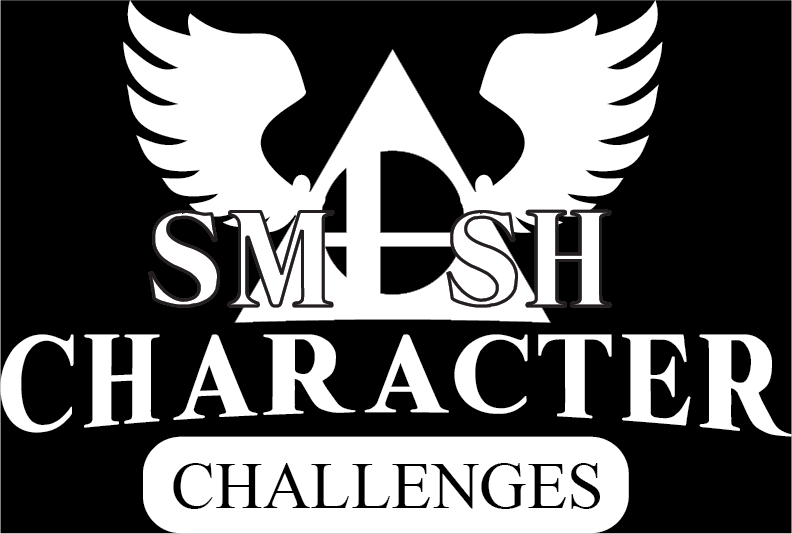

# Smash Character Challenge

[smash.natesabrown.com](https://smash.natesabrown.com/)

  

## Description

A React app to play local multiplayer smash with specific challenges of different challenge levels for each character.

## Features

* "Easy," "Medium," and "Hard" challenges for each character.
* Exclude non-purchased DLC from the character pool.
* Keep track of each player's points.
* Install application as a PWA on your phone.
* Looks good on tablets, phones, and computers.

## Future Goals

**(8/6/21):**

* I hope to move the images from the original websites to a custom CDN.
* Minor UI/UX improvements to improve the overall flow (footer, box-sizing changes, DLC section border).
* Add an info section on how to play